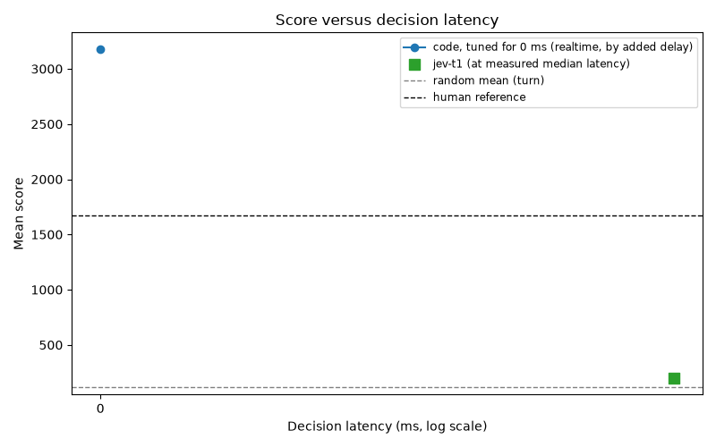

# Space Invaders benchmark report

This file is generated by `python -m invaders report`. Do not edit it by hand; regenerate it instead (see "How to regenerate" below).

## The input tier ladder

| decider | input | turn mean (n) | realtime mean (n) | latency p50 (ms) | cost per game (USD) |
|---|---|---|---|---|---|
| code | rules over the decoded state | 2682 (20) | 3180 (5) | 0.0 | 0.0000 |
| jev-t3 | Tier 3: code verdicts (reference) | 2154 (5) | - | 98.6 | 0.1490 |
| jev-t2 | Tier 2: exact facts, relative | 194 (5) | - | 93.3 | 0.0252 |
| jev-t1 | Tier 1: decoded positions | 296 (11) | 198 (5) | 92.4 | 0.0228 |
| llm-t2 | Tier 2: exact facts, relative | 103 (5) | - | 1063.6 | 0.7269 |
| llm-t1 | Tier 1: decoded positions | 102 (6) | - | 1068.0 | 0.6052 |
| qwen-t2 | Tier 2: exact facts, relative | 185 (2) | - | 2292.6 | 0.0000 |
| qwen-t1 | Tier 1: decoded positions | 136 (6) | - | 2466.6 | 0.0000 |
| always-fire | none: presses FIRE every step | 285 (20) | - | 0.0 | 0.0000 |
| random | no input | 115 (11) | - | 0.0 | 0.0000 |

## Summary

| player | mode | games | mean score | median | min | max | stdev | human-norm mean | mean steps | latency p50 (ms) | latency p95 (ms) | model calls/game | input tok/game | output tok/game | cost/game ($) | fallback rate | errors | hit rate | served model(s) |
|---|---|---|---|---|---|---|---|---|---|---|---|---|---|---|---|---|---|---|---|
| code | turn | 20 | 2682.2 | 3072.5 | 800.0 | 4180.0 | 1159.7 | 1.667 | 2928.2 | 0.00 | 0.00 | 0.00 | 0.0 | 0.0 | 0.0000 | 0.000 | 0 | n/a | deterministic-code-v5 |
| code | realtime | 5 | 3180.0 | 3780.0 | 800.0 | 3965.0 | 1337.8 | 1.994 | 3498.0 | 0.00 | 0.00 | 0.00 | 0.0 | 0.0 | 0.0000 | 0.000 | 0 | n/a | deterministic-code-v5 |
| jev-t3 | turn | 5 | 2154.0 | 2335.0 | 840.0 | 2930.0 | 831.5 | 1.319 | 2639.8 | 98.62 | 151.29 | 2639.80 | 3548365.4 | 178268.6 | 0.1490 | 0.000 | 0 | n/a | jev-1.13.0 |
| jev-t2 | turn | 5 | 194.0 | 210.0 | 135.0 | 240.0 | 46.6 | 0.030 | 665.4 | 93.31 | 142.34 | 665.40 | 599606.0 | 44983.6 | 0.0252 | 0.000 | 0 | n/a | jev-1.13.0 |
| jev-t1 | turn | 11 | 296.4 | 240.0 | 105.0 | 660.0 | 181.6 | 0.098 | 732.4 | 92.15 | 143.86 | 732.36 | 681639.3 | 49600.2 | 0.0286 | 0.000 | 0 | n/a | jev-1.13.0 |
| jev-t1 | realtime | 5 | 198.0 | 180.0 | 155.0 | 260.0 | 49.1 | 0.033 | 664.4 | 92.72 | 142.51 | 257.60 | 240751.0 | 17441.0 | 0.0101 | 0.000 | 0 | n/a | jev-1.13.0 |
| llm-t2 | turn | 5 | 103.0 | 40.0 | 15.0 | 285.0 | 111.6 | -0.030 | 519.2 | 1063.64 | 1754.22 | 519.20 | 585772.2 | 28222.0 | 0.7269 | 0.000 | 0 | n/a | claude-haiku-4-5 |
| llm-t1 | turn | 6 | 101.7 | 82.5 | 35.0 | 230.0 | 69.8 | -0.030 | 434.8 | 1068.01 | 1753.04 | 434.83 | 487397.2 | 23556.3 | 0.6052 | 0.000 | 0 | n/a | claude-haiku-4-5 |
| qwen-t2 | turn | 2 | 185.0 | 185.0 | 50.0 | 320.0 | 190.9 | 0.024 | 476.0 | 2292.55 | 2700.97 | 476.00 | 156809.0 | 38882.5 | 0.0000 | 0.011 | 10 | n/a | qwen3.8:latest |
| qwen-t1 | turn | 6 | 135.8 | 105.0 | 50.0 | 250.0 | 74.0 | -0.008 | 533.7 | 2466.58 | 3076.42 | 533.67 | 221254.3 | 43723.8 | 0.0000 | 0.017 | 56 | n/a | qwen3.8:latest |
| always-fire | turn | 20 | 285.0 | 285.0 | 285.0 | 285.0 | 0.0 | 0.090 | 726.0 | 0.00 | 0.00 | 0.00 | 0.0 | 0.0 | 0.0000 | 0.000 | 0 | n/a | always-fire |
| random | turn | 11 | 114.5 | 110.0 | 30.0 | 225.0 | 49.0 | -0.022 | 447.6 | 0.01 | 0.01 | 0.00 | 0.0 | 0.0 | 0.0000 | 0.000 | 0 | n/a | random-policy |

## Head-to-head at Tier 2: jev-t2 vs. llm-t2 (mode turn)

| seed | jev-t2 score | llm-t2 score | winner |
|---|---|---|---|
| 101 | 230.0 | 285.0 | llm-t2 |
| 102 | 240.0 | 15.0 | jev-t2 |
| 103 | 135.0 | 135.0 | tie |
| 104 | 210.0 | 40.0 | jev-t2 |
| 105 | 155.0 | 40.0 | jev-t2 |

Total: jev-t2 wins 3, llm-t2 wins 1, ties 1 (of 5 shared seeds).

## Head-to-head at Tier 1: jev-t1 vs. llm-t1 (mode turn)

| seed | jev-t1 score | llm-t1 score | winner |
|---|---|---|---|
| 101 | 110.0 | 55.0 | jev-t1 |
| 102 | 300.0 | 80.0 | jev-t1 |
| 103 | 410.0 | 125.0 | jev-t1 |
| 104 | 105.0 | 230.0 | llm-t1 |
| 105 | 180.0 | 35.0 | jev-t1 |
| 119 | 425.0 | 85.0 | jev-t1 |

Total: jev-t1 wins 5, llm-t1 wins 1, ties 0 (of 6 shared seeds).

## Turn versus realtime

| player | shared seeds | mean turn score | mean realtime score | drop (%) |
|---|---|---|---|---|
| jev-t1 | 5 | 221.0 | 198.0 | 10.4 |

## Latency curve

| added_delay_ms | code, tuned for 0 ms (mean, n) |
|---|---|
| 0 | 3180.0 (5) |

See `latency_curve.png` for the chart.



## Version history (turn mode)

The tables above use each player's latest version.

| player | version | games | seeds | mean score | notes |
|---|---|---|---|---|---|
| code | v5 | 20 | 101-120 | 2682.2 | code player v5: lowest row first in the last drop |
| jev-t3 | q8 | 5 | 101-105 | 2154.0 | Tier 3 reference: question v8, the code player's v3 verdicts and rules |
| jev-t2 | q7 | 5 | 101-105 | 194.0 | Tier 2 question v7 (exact facts relative to the ship, v3 fleet model) |
| jev-t1 | q3 | 11 | 101-119 | 296.4 | Tier 1 question v3 (decoded positions, the organizers' state) |
| llm-t2 | q7 | 5 | 101-105 | 103.0 | Tier 2 question v7 (v3 fleet model), claude-haiku-4-5 through the System One adapter |
| llm-t1 | q3 | 6 | 101-119 | 101.7 | Tier 1 question v3, claude-haiku-4-5 through the System One adapter |
| qwen-t2 | q7 | 2 | 101-102 | 185.0 | Tier 2 question v7 (v3 fleet model), Qwen3.8 27B (Q4_K_M) through Ollama, thinking off, through the System One adapter |
| qwen-t1 | q3 | 6 | 101-119 | 135.8 | Tier 1, Qwen3.8 27B (Q4_K_M) through Ollama, thinking off, through the System One adapter |
| always-fire | v1 | 20 | 101-120 | 285.0 | floor: presses FIRE every step |
| random | v1 | 11 | 101-119 | 114.5 | random floor |

## How to regenerate

```
python -m invaders bench --players code,code-la,random,jev,llm --seeds 101-110 \
    --modes turn,realtime --delays 0,50,100,250,500,1000,2000 --skip-existing
python -m invaders report --out report/
```
